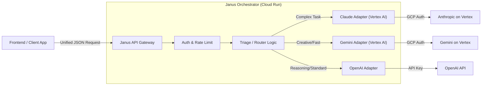

# Janus IA: Meta Chat Orchestrator

**Status:** Prototype / MVP
**Author:** Atlas (Senior Backend Architect) for Miguel Escalante

---

## Executive Summary

"Janus IA" is a unified LLM orchestration layer designed to decouple the client application from specific model providers. By sitting between the frontend and the LLMs, Janus enables dynamic routing based on cost, performance, and capability without requiring client-side changes.

This architecture leverages **FastAPI** for high-performance async I/O (crucial for streaming tokens) and adopts a **Provider Adapter Pattern** to normalize the disparate APIs of Vertex AI (Claude/Gemini) and OpenAI.

## High-Level Architecture

The system follows a standard **Gateway / Router** pattern.



## Core Components

### Unified Interface
Janus exposes an **OpenAI-compatible API**. This allows existing tools (like LangChain or standard UI chat kits) to connect by simply changing the `base_url`.

### Router / Triage Logic
*   **Tier 1 (Explicit):** Direct model alias selection.
*   **Tier 2 (Heuristic - MVP):**
    *   *Code/Complex Logic:* -> **Claude 3.5 Sonnet (Vertex)**.
    *   *Creative/General:* -> **Gemini 1.5 Pro (Vertex)**.
    *   *Fallback:* -> **GPT-4o**.

### Auth & Configuration
*   **GCP Vertex:** Uses **Workload Identity Federation** or `ADC`.
*   **OpenAI:** Secret Manager / Env Vars.

## Code Structure

```text
janus-ia/
├── app/
│   ├── core/          # Config, Security, Exceptions
│   ├── models/        # Pydantic Schemas (OpenAI compat)
│   ├── providers/     # Adapters (OpenAI, Vertex Claude, Vertex Gemini)
│   ├── router/        # Intelligence & API Routes
│   └── main.py        # Entrypoint
├── tests/
├── Dockerfile
├── pyproject.toml
└── README.md
```

## Quick Start

```bash
# Local dev with uv
cp .env.example .env   # add OPENAI_API_KEY, GCP_* as needed
uv run uvicorn app.main:app --reload --port 8080

# Or Docker
docker compose up
```

Then call the OpenAI-compatible endpoint:

```bash
curl -X POST http://localhost:8080/v1/chat/completions \
  -H "Content-Type: application/json" \
  -d '{"model":"gpt-4o","messages":[{"role":"user","content":"Hello"}],"stream":false}'
```

## Dependencies

*   Python >= 3.11
*   FastAPI
*   Uvicorn
*   Pydantic Settings
*   OpenAI SDK
*   Anthropic[vertex]
*   Google Cloud AI Platform
